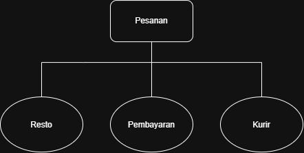

# Tugas 2 - Arsitektur Sistem Decouple

**Kelompok:** [yencefran]
| Nama                  | NIM            | Kontribusi                       |
| --------------------- | -------------- | -------------------------------- |
| [Grace Roswita Sallu] | [103072400093] | [Menganalisis kekurangan arsitektur lama dan menyusun skenario] |
| [Yustinus Yendy S.A]  | [103072400065] | [Perancangan arsitektur, message broker, dan diagram]                      |
| [Efran Gustine Y]     | [103072400046] | [Menjelaskan alur skenario, analisis trade-off] |

### **Bukti di Skenario:**
    Pada desain lama () pesanan terhubung secara langsung dengan resto, pembayaran, dan kurir. Sehingga setiap modul harus berkomunikasi secara langsung untuk menjalankan proses pemesanan, pembayaran, dan pengantaran

### **Kenapa arsitektur pertama keliru:**
    Karena arsitektur itu membuat setiap layanan memiliki ketergantungan langsung satu sama lain. Di mana jika terdapat perubahan atau terjadi masalah di salah satu service saja, komunikasi dengan service lain juga akan ikut terdampak. Selain itu, semakin banyak layanan yang ditambahkan akan semakin banyak juga hubungan langsung yang harus dikelola

### **Dampak ke FoodGo:**
    Sistem menjadi ketergantungan dengan antar servicenya, jadi sistem semakin sulit dikembangkan dan dimaintenace. Kemudian jika FoodGo ingin menambahkan atau mengubah service, koneksi dengan service lain juga perlu disesuaikan lagi. Sehingga dapat meningkatkan kompleksitas sistem dan membuat proses deplyoment menjadi kurang fleksibel

**Solusi Arsitektur Awal:**

### 1. Memisahkan modul menjadi beberapa service
    Pesanan, pembayaran, resto, dan kurir dapat dipisahkan menjadi service yang memiliki tugas masing-masing 

### 2. Menambahkan Message Broker
    Message broker digunakan sebagai perantara komunikasi antar service. Di mana pesanan dapat mengirim event seperti OrderCreated ke Message Broker, kemudian event tersebut diteruskan kepada resto. Dan pembayaran juga dapat mengirim PaymentCompleted melalui message broker untuk diteruskan ke kurir

## **Alur Skenario End-to-End:**

### 1. Pelanggan membuat pesanan

    Pelanggan membuat pesanan lewat Service Pesanan. Di bagian ini prosesnya
    masih sinkron, karena pelanggan mengirim request lalu mendapatkan response
    dari Service Pesanan.

### 2. Melakukan pembayaran

    Setelah pesanan dibuat, Service Pesanan mengirim RequestPayment ke Service
    Pembayaran. Service Pesanan akan menunggu hasil pembayaran sebelum lanjut
    ke proses berikutnya.

### 3. Pembayaran berhasil

    Kalau pembayaran berhasil, Service Pembayaran mengirim event
    PaymentCompleted ke Message Broker. Setelah itu, Message Broker akan
    mengirimkan informasi tersebut ke service yang membutuhkan.

### 4. Resto menerima informasi

    Service Katalog Resto menerima informasi PaymentCompleted dari Message
    Broker. Setelah pembayaran berhasil, Resto bisa mulai memproses pesanan.

### 5. Kurir menerima informasi

    Service Kurir juga menerima informasi dari Message Broker. Setelah tahu
    pembayaran sudah berhasil, Kurir bisa mulai mencari atau menentukan kurir
    untuk pesanan tersebut.
### Jenis Komunikasi

| Komponen | Komunikasi | Jenis |
|---|---|---|
| Pelanggan dan Service Pesanan | Request dan response | Sinkron |
| Service Pesanan dan Service Pembayaran | RequestPayment | Sinkron / Request-Response |
| Service Pembayaran dan Message Broker | PaymentCompleted | Asinkron / Event |
| Message Broker dan Service Katalog Resto | PaymentCompleted | Asinkron / Event |
| Message Broker dan Service Kurir | PaymentCompleted | Asinkron / Event |

## **Trade-Off Publish-Subscribe**

### 1. Sistem jadi lebih rumit

    Karena ada Message Broker, sistem jadi punya bagian tambahan yang harus
    dikelola. Jadi tidak cuma mengurus service Pesanan, Pembayaran, Resto,
    dan Kurir saja.

### 2. Kalau ada error lebih susah dicari

    Karena komunikasi menggunakan event, kita tidak selalu tahu masalahnya
    terjadi di service mana. Jadi harus dicek dari service yang mengirim,
    Message Broker, sampai service yang menerima.

### 3. Pesan bisa bermasalah

    Event yang dikirim bisa saja terlambat, gagal diproses, atau bahkan
    diterima lebih dari satu kali. Hal seperti ini perlu diperhatikan supaya
    tidak mengganggu proses pesanan.

### 4. Tetap bergantung pada Message Broker

    Walaupun service sudah tidak saling terhubung langsung, semuanya masih
    membutuhkan Message Broker untuk mengirim event. Jadi kalau Message Broker
    bermasalah, komunikasi antar-service juga bisa ikut terganggu.

### 5. Lebih gampang kalau mau tambah service

    Kalau nantinya FoodGo mau menambahkan service baru, service tersebut bisa
    langsung menjadi subscriber dari event yang dibutuhkan. Jadi tidak perlu
    membuat banyak hubungan langsung dengan service lainnya.